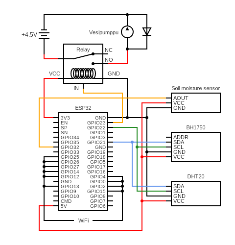

# Plant node

## Equipment  
- ESP32-microcontroller board  
- BH1750, luminosity sensor  
- DHT20, humidity and temperature sensor  
- KeeYees capacitive soil moisture sensor  
- Az-Delivery "low-trigger" relay module  
- Small (5V) submersible water pump  
- 3 x AA battery holder  
- 3 x 1.5V AA lithium batteries  
- Punch of wires  

## Software  
* InfluxDB  
* MQTT Broker  

## ESP32 pin setup.  

  

```cpp
#define RELAY_PIN 23                          // GPIO pin for relay
#define SDA_PIN 21                            // GPIO pin for I2C communication SDA pin
#define SCL_PIN 22                            // GPIO pin for I2C communication SCL pin
#define SOIL_MOISTURE_PIN 32                  // GPIO pin for soil moisture sensor
```  

## Circuit diagram

  

<br/>

# Database - InfluxDB  

[Source file](src/database.cpp)  

https://github.com/tobiasschuerg/InfluxDB-Client-for-Arduino  

<br/>

# MQTT

[Source file](src/mqtt.cpp)  

Handles connecting and reconnecting to local MQTT broker. Read messages on specific topics and calls function based on the topic. These messages are used to control [watering settings](README.md#watering-settings).  

# Sensors  

[Source file](src/sensor.cpp)  

### <ins>BH1750 - Luminosity</ins>  

https://github.com/claws/BH1750  

Uses I2C-bus for the communication.  
Has address **0x23**.  

<br/>

### <ins>DHT20 - temperature & humidity</ins>  

https://github.com/RobTillaart/DHT20  

DHT20 uses I2C-bus for communication.  
The sensor has a fixed address of **0x38**. It is not known if the address can be changed.  

<br/>

### <ins>Soil moisture</ins>  

To measure soil moisture we use capacitive soil moisture sensor. Soil moisture is measured as a small voltage and converted with ESP32 ADC to digital value, which can be used to estimate soil moisture.  

Soil moisture is read using readAnalog() function.  

### Running average  

Lib: [RunningAverage](lib/RunningAverage)  

Because soil moisture readings will have some variance we must use running average to get more precise reading of the current soil moisture.  

Soil moisture readings are stored in `RUNNING_AVERAGE_SIZE` -sized buffer. Once buffer is full we can get average of the soil moisture by calculating SUM/SIZE=AVG. Newest reading always replaces oldest reading.  
```cpp
RunningAverage runningSoilMoisture = RunningAverage(RUNNING_AVERAGE_SIZE);
```  

<br/>

# Watering  

[Source file](src/watering.cpp)  

### Watering relay

Relay is controlled with digitalWrite() function. Since we are using "low-level trigger" relay we set PIN state to LOW to turn watering on.  

### Watering settings  

**Threshold**  
```cpp
unsigned int wateringThreshold;  
```  
Soil moisture threshold used to control when watering is needed.  
Lower = Wetter, Higher = Drier.  

<br/>

**Duration**  
```cpp
unsigned int wateringDuration;  
```  
Duration how long watering lasts == how long relay/pump is turned on.  

<br/>

**Repeat**  
```cpp
unsigned int wateringRepeat;  
```  
How many times plant is watered once watering triggers. This basicly multiplies duration.  

<br/>

**Soak time**
```cpp
unsigned int wateringSoakTime;  
```  
How long to wait between watering repeats. This is basicly just to wait little to let water soak into soil and prevent over pouring of the edges.  

<br/>

**Interval**
```cpp
unsigned int wateringInterval;  
```  
How long to wait between watering triggers. This can be from hours to weeks.   

<br/>

**Watering can be done either peridically or when soil moisture is too low.**  

If threshold is low watering can be set to be done periodically using Interval.  
If threshold is set correctly and interval is low, watering will happen based on soil moisture. However interval should always be set to some extent to prevent over watering.  

