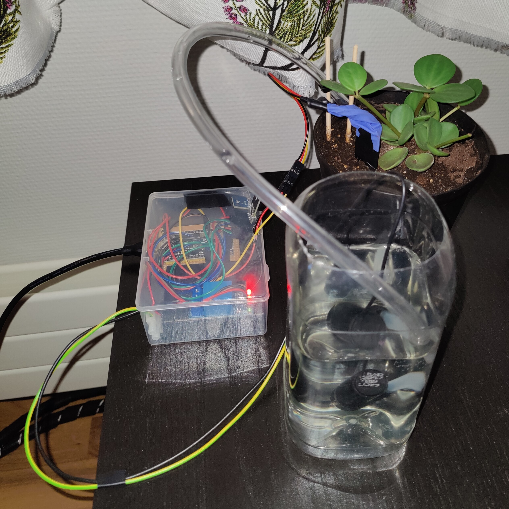

# Smart Plant System

**This project was initially started in 10/2023 as a Thesis project, but has since been refactored and updated.**  

  

## Plant node  

More: [Plant node](PlantNode/README.md)  

ESP32-microcontroller device used to monitor plant and control watering.  

  

## Control panel  

More: [Control panel](ControlPanel/README.md)  

Local network website used to control parameters and settings of plant nodes.  

  

## Used software  

**InfluxDB** - Database to store data from the plants.  
**Eclipse Mosquitto** - MQTT broker to relay setting changes from the control panel to nodes.  

